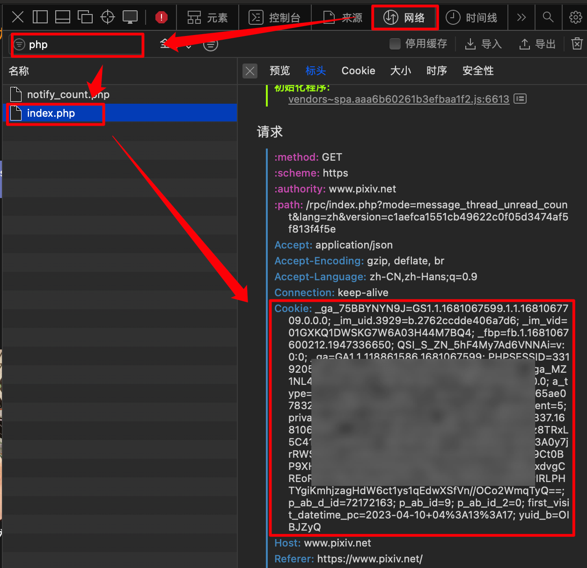

[![Contributors][contributors-shield]][contributors-url]
[![Forks][forks-shield]][forks-url]
[![Stargazers][stars-shield]][stars-url]
[![Issues][issues-shield]][issues-url]
[![MIT License][license-shield]][license-url]


<!-- PROJECT LOGO -->
<br />

<div align="center">
  <a href="https://github.com/kingwingfly/tauri-pixiv-crawler-rs">
    
  </a>

  <h3 align="center">Tauri Pixiv Crawler</h3>

  <p align="center">
    A pixiv crawler app built by Tauri, Vue and Rust!
    <br />
    <a href="https://github.com/kingwingfly/tauri-pixiv-crawler-rs"><strong>Explore the docs »</strong></a>
    <br />
    <br />
    <a href="https://github.com/kingwingfly/tauri-pixiv-crawler-rs">View Demo</a>
    ·
    <a href="https://github.com/kingwingfly/tauri-pixiv-crawler-rs/issues">Report Bug</a>
    ·
    <a href="https://github.com/kingwingfly/tauri-pixiv-crawler-rs/issues">Request Feature</a>
  </p>
</div>


<!-- TABLE OF CONTENTS -->

<details>
  <summary>Table of Contents</summary>
  <ol>
    <li>
      <a href="#about-the-project">About The Project</a>
      <ul>
        <li><a href="#built-with">Built With</a></li>
      </ul>
    </li>
    <li>
      <a href="#getting-started">Getting Started</a>
      <ul>
        <li><a href="#prerequisites">Prerequisites</a></li>
        <li><a href="#installation">Installation</a></li>
      </ul>
    </li>
    <li><a href="#usage">Usage</a></li>
    <li><a href="#roadmap">Roadmap</a></li>
    <li><a href="#contributing">Contributing</a></li>
    <li><a href="#license">License</a></li>
    <li><a href="#contact">Contact</a></li>
    <li><a href="#acknowledgments">Acknowledgments</a></li>
  </ol>
</details>


<!-- ABOUT THE PROJECT -->
## About The Project

[![Product Name Screen Shot][product-screenshot]](https://github.com/kingwingfly/tauri-pixiv-crawler-rs/)

This a Crawler or Downloader for pixiv built by Tauri and Rust.

Here are advantages:
* Simultaneous downloads: Your image downloader can potentially download multiple images at once, making it a faster and more efficient tool for users.
* Reduced storage space: A smaller-sized image downloader can potentially take up less space on the user's device, which is especially beneficial for devices with limited storage capacity.

<p align="right">(<a href="#readme-top">back to top</a>)</p>


### Built With

* [![Rust][RustLogo]][Rust-url]
* [![Tauri][TauriLogo]][Tauri-url]
* [![Tokio][TokioLogo]][Tokio-url]
* [![Vue][Vue.js]][Vue-url]

<p align="right">(<a href="#readme-top">back to top</a>)</p>


<!-- GETTING STARTED -->
## Getting Started

You can compile by yourself.

### Prerequisites

You need rust, tauri-cli, npm first. 
* rust
  ```sh
  npm install npm@latest -g
  ```
* rust
  ```sh
  cargo install create-tauri-app
  ```

And maybe you need this [Tauri Quick Start](https://tauri.app/v1/guides/getting-started/setup) for further infomation. 

### Installation

_Below is an example of how you can instruct your audience on installing and setting up your app. This template doesn't rely on any external dependencies or services._

1. Get a free API Key at [https://example.com](https://example.com)
2. Clone the repo
   ```sh
   git clone https://github.com/kingwingfly/tauri-pixiv-crawler-rs.git
   cd tauri-pixiv-crawler-rs
   ```
3. Install NPM packages
   ```sh
   npm install
   ```
4. start compile
   ```sh
   cargo tauri build
   ```

<p align="right">(<a href="#readme-top">back to top</a>)</p>


<!-- USAGE EXAMPLES -->
## Usage

Maybe can get you cookie through your browser.




You may don't need a proxy, however the proxy is must by v0.0.1 version.


<p align="right">(<a href="#readme-top">back to top</a>)</p>


<!-- ROADMAP -->
## Roadmap

- [x] Tokio simultaneous
- [x] Return progress in real time
- [x] Interrupt and restart
- [ ] Run without proxy

See the [open issues](https://github.com/kingwingfly/tauri-pixiv-crawler-rs/issues) for a full list of proposed features (and known issues).

<p align="right">(<a href="#readme-top">back to top</a>)</p>


<!-- CONTRIBUTING -->
## Contributing

Contributions are what make the open source community such an amazing place to learn, inspire, and create. Any contributions you make are **greatly appreciated**.

If you have a suggestion that would make this better, please fork the repo and create a pull request. You can also simply open an issue with the tag "enhancement".
Don't forget to give the project a star! Thanks again!

1. Fork the Project
2. Create your Feature Branch (`git checkout -b feature/AmazingFeature`)
3. Commit your Changes (`git commit -m 'Add some AmazingFeature'`)
4. Push to the Branch (`git push origin feature/AmazingFeature`)
5. Open a Pull Request

<p align="right">(<a href="#readme-top">back to top</a>)</p>


<!-- LICENSE -->
<!-- ## License

Distributed under the MIT License. See `LICENSE.txt` for more information.

<p align="right">(<a href="#readme-top">back to top</a>)</p> -->


<!-- CONTACT -->
## Contact

Louis - [@email](20200581@cqu.edu.cn) - email@example.com

Project Link: [https://github.com/kingwingfly/tauri-pixiv-crawler-rs](https://github.com/kingwingfly/tauri-pixiv-crawler-rs)

<p align="right">(<a href="#readme-top">back to top</a>)</p>


<!-- ACKNOWLEDGMENTS -->
## Acknowledgments

Some document may help in develop tauri app and crawler.

* [Tauri Example](https://github.com/tauri-apps/tauri/tree/dev/examples)
* [Tokio Quick Tutorial](https://tokio.rs/tokio/tutorial)
* [Rust Reqwest](https://crates.io/crates/reqwest)
* [Vue Document](https://router.vuejs.org/zh/guide/)
* [A python Async Pixiv Crawler](https://github.com/kingwingfly/PixivCrawlerAsync)
* [A python pixiv crawler](https://github.com/CWHer/PixivCrawler)

<p align="right">(<a href="#readme-top">back to top</a>)</p>


<!-- MARKDOWN LINKS & IMAGES -->
<!-- https://www.markdownguide.org/basic-syntax/#reference-style-links -->
[contributors-shield]: https://img.shields.io/github/contributors/kingwingfly/tauri-pixiv-crawler-rs.svg?style=for-the-badge
[contributors-url]: https://github.com/kingwingfly/tauri-pixiv-crawler-rs/graphs/contributors
[forks-shield]: https://img.shields.io/github/forks/kingwingfly/tauri-pixiv-crawler-rs.svg?style=for-the-badge
[forks-url]: https://github.com/kingwingfly/tauri-pixiv-crawler-rs/network/members
[stars-shield]: https://img.shields.io/github/stars/kingwingfly/tauri-pixiv-crawler-rs.svg?style=for-the-badge
[stars-url]: https://github.com/kingwingfly/tauri-pixiv-crawler-rs/stargazers
[issues-shield]: https://img.shields.io/github/issues/kingwingfly/tauri-pixiv-crawler-rs.svg?style=for-the-badge
[issues-url]: https://github.com/kingwingfly/tauri-pixiv-crawler-rs/issues
[license-shield]: https://img.shields.io/github/license/kingwingfly/tauri-pixiv-crawler-rs.svg?style=for-the-badge
[license-url]: https://github.com/kingwingfly/tauri-pixiv-crawler-rs/blob/master/LICENSE.txt
[linkedin-shield]: https://img.shields.io/badge/-LinkedIn-black.svg?style=for-the-badge&logo=linkedin&colorB=555
[linkedin-url]: https://linkedin.com/in/othneildrew
[product-screenshot]: images/screenshot.png
[RustLogo]: https://www.rust-lang.org/static/images/rust-logo-blk.svg
[Rust-url]: https://github.com/rust-lang/rust
[TauriLogo]: https://github.com/tauri-apps/tauri/blob/dev/.github/splash.png?raw=true
[Tauri-url]:https://github.com/tauri-apps/tauri
[TokioLogo]: https://tokio.rs/img/tokio-horizontal.svg
[Tokio-url]: https://tokio.rs
[Vue.js]: https://img.shields.io/badge/Vue.js-35495E?style=for-the-badge&logo=vuedotjs&logoColor=4FC08D
[Vue-url]: https://vuejs.org/
